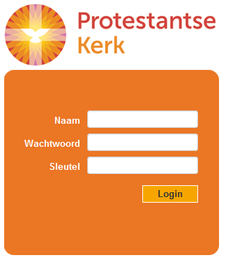
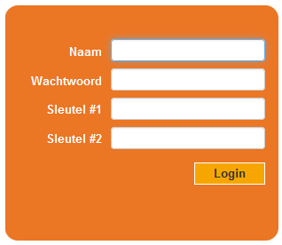

# De ledenadministrateur

* This will become a table of contents (this text will be scraped).
{:toc}

## Inleiding

Als **ledenadministrateur** bent u de spil van het ledenregistratiesysteem.

U bent verantwoordelijk voor het onderhoud en beheer van de gegevens van de geregistreerden van uw (wijk)gemeente. Als ledenadministrateur zorgt u ervoor dat de gegevens van elk gemeentelid kloppen en actueel zijn. Daarnaast assisteert u de andere gebruikers bij het ontsluiten van informatie uit LRP door bijvoorbeeld het maken van selecties, etc. Het is mogelijk om uw functie als ledenadministrateur te combineren met die van bijdragenadministrateur, dit kan op één en dezelfde sleutel.

De mutaties, die u als ledenadministrateur ontvangt, komen binnen via **SILA**, die op haar beurt een koppeling heeft met de GBA.
Vanuit de **GBA worden de volgende mutaties doorgegeven aan de: verhuizing, naamswijziging, bericht van overlijden, begin- en einddatum burgerlijke staat en adres geheim. Deze uitwisseling van mutaties, zowel die van SILA als van plaatselijke gemeenten, waarborgt de actualiteit van de gegevens van LRP. 

## Bevoegdheden
Als ledenadministrateur bent u namens en in opdracht van de kerkenraad bevoegd in uw gemeente om de gegevens van de leden te wijzigen. Daarom zullen alle gebruikers een beroep op u doen voor correcties en/of aanpassingen van gegevens. Door het recht op het kunnen wijzigen van ledengegevens bij één functie te houden, kan de kwaliteit en de consistentie van gegevens gemakkelijker worden gegarandeerd.

## Actueel en nauwkeurig
Nadat u als ledenadministrateur bent ingelogd krijgt u in het startscherm een overzicht met SILA mutaties, gesorteerd op datum of type.
Deze meldingen gaan onder andere over overlijdens, verbintenissen, inkomende en vertrekkende leden, aanvragen van andere gemeenten (bijvoorbeeld overschrijvingen van voorkeursleden), etc. Naar aanleiding van deze meldingen kunt u eenvoudig de mutaties doorvoeren en verwerken en de overschrijvingen accepteren of weigeren. Wanneer u aanvragen vanuit andere gemeenten accepteert, worden de gegevens voor alle betrokkenen automatisch aangepast in LRP. 

Het voeren van een nauwkeurige ledenadministratie is van vitaal belang voor het succesvol kunnen inzetten van LRP door de andere systeemgebruikers binnen uw gemeente.  
De pastorale zorg binnen uw gemeente is afhankelijk van een juiste inzicht in het ledenbestand en de samenstelling van de pastorale eenheden. 
De bijdragenadministratie is volledig afhankelijk van een up-to-date ledenregistratie voor een juiste afwikkeling van de fondsen- en abonnementenadministratie.

## Oefenen

## Dienstverlening
Als gebruiker heeft u ook een aantal mogelijkheden voor dienstverlening. Zo kunt u bijvoorbeeld op eenvoudige wijze rapportages maken en afdrukken naar een pdf-bestand, groepen definiëren en selecties maken voor verdere verwerking in bijvoorbeeld fondsen en abonnementen en voor het exporteren van gegevens naar een spreadsheetprogramma.

## Inloggen met uw authenticatiesleutel

Open uw browser (bij voorkeur Firefox, Google Chrome of Internet Explorer / Edge.  
	
Type in de adresbalk van de browser: [lrp.pkn.nl](http://lrp.pkn.nl).

> **Let op:** Het adres van LRP begint niet met www!

Het door u ingegeven adres verandert vanzelf in het beveiligde adres http**s**://lrp.pkn.nl/

Het volgende scherm verschijnt:

Uw naam is het e-mailadres dat u aan uw lokaal beheerder hebt doorgegeven. Het wachtwoord is het wachtwoord dat u via hetzelfde e-mailadres hebt ontvangen.

> **Let op:** zowel de naam als het wachtwoord zijn hoofdlettergevoelig!

In het veld **sleutel** vult u de code in die, nadat u hebt gedrukt op het knopje van de authenticatiesleutel, in het venster (display) verschijnt.

	
Klik in het inlogscherm op het knopje **Login**.

Het door de **lokaal beheerder** toegewezen wachtwoord kan door de gebruiker zelf worden gewijzigd. Ga naar **Gebruikers** in het menu **Beheer**. Vul een nieuw wachtwoord in en klik op **Opslaan**.
	
Het startscherm van LRP verschijnt (als dit niet goed opent dient u het scherm te verversen met de functietoets F5. Dit gebeurt voornamelijk bij gebruik van Internet Explorer).

## Wachtwoord wijzigen

Het wijzigen van het wachtwoord kan door de gebruiker zelf worden gedaan.  
Ga naar **Gebruikers** in het menu **Beheer**. Vul een nieuw wachtwoord in en klik op **Opslaan**.

Indien niet meer kan worden ingelogd in LRP dient een **nieuw wachtwoord** te worden verstrekt door de lokaal beheerder.

Deze kan een door de gebruiker op te geven nieuw wachtwoord invoeren of het wachtwoord resetten waarna dit automatisch wordt toegezonden aan de gebruiker. (Dit werk alleen indien de inlognaam van de gebruiker ene geldig e-mailadres is!)

Voor meer informatie zie de handleiding Lokaal Beheerder, paragraaf gebruiker bewerken.

## Problemen bij inloggen

Het kan zijn dat het inloggen in LRP niet lukt, dit kan verschillende oorzaken hebben.

### Verkeerde combinatie naam / wachtwoord / sleutel.
	
Als veiligheidsmaatregel wordt een gebruiker na drie foutieve inlogpogingen (automatisch) voor vijf minuten geblokkeerd. Gedurende deze tijd kan er met de betreffende gebruikersnaam niet worden ingelogd.

Vergewis u ervan dat u de juiste **gebruikersnaam** en **wachtwoord** gebruikt; de gebruikersnaam en het wachtwoord zijn hoofdlettergevoelig!

De **code** van de **authenticatiesleutel** is maar gedurende korte tijd geldig, u dient deze direct na weergave in het venstertje in te typen in het veld **Sleutel**. Genereer nogmaals een code door te drukken op het knopje van de authenticatiesleutel en vul deze code in in het veld **Sleutel**; controleer ook dat u de juiste authenticatiesleutel gebruikt ingeval u over meerdere  authenticatiesleutel beschikt.

Na 5 minuten schakelt LRP de gebruikersnaam weer vrij om in te loggen.

### Internetadres onjuist.

Het adres in de adresbalk van uw browser moet luiden: **https://lrp.pkn.nl**. (let op het **https**). Ververs deze pagina met de toets [F5] of met de toetsen [Ctrl]+[F5].

Lukt het inloggen nog niet, neem dan contact op met uw lokaal beheerder (en voor de lokaalbeheerder neem contact op met de helpdesk LRP).
	
### Browsergeschiedenis.

Omdat LRP via een browser functioneert kan het incidenteel voorkomen dat zich in de cache van uw browser verkeerde / verouderde 'software' bevindt. Dit wil wel eens gebeuren als de software van LRP wordt vernieuwd.

Dit probleem is eenvoudig op te lossen door in uw browser de cache te legen.
	
Het legen van de cache (browsergeschiedenis) verschilt per browser en per versie van de browser. Een algemeen geldende instructie kunnen we dan ook niet geven. In veel (moderne) browsers werkt de toestcombinatie [CTRL] + [SHIFT] + [DELETE].

Vergewis u er wel van dat u alleen de browsergeschiedenis weggooit, niet uw cookies of wachtwoorden o.i.d!

### Synchroniseren

De melding `Uw sleutel kon niet worden geauthenticeerd. Wilt u proberen te synchroniseren?' verschijnt onder de knop **Login** in beeld. Dit betekent dat uw naam en wachtwoord juist zijn maar dat LRP de code van uw sleutel niet kan valideren.
	
* klik in het inlogscherm op **synchroniseren**

		
* onder de velden **Naam** en **Wachtwoord** verschijnen **twee** velden om (sleutel)codes in te brengen

* vul opnieuw uw naam en wachtwoord in

* vul in het veld **Sleutel \#1** de code in die verschijnt na het drukken op het knopje van de authenticatiesleutel (`digipass');

* druk vervolgens herhaaldelijk op het knopje van de authenticatiesleutel totdat er een **nieuwe** code verschijnt;

* vul dit nummer in in het veld **Sleutel \#2** en klik op de knop **Login**.

Lukt het inloggen nog niet, neem dan contact op met uw lokaal beheerder.

> **Let op:** het is niet mogelijk in dezelfde browser gelijktijdig met twee verschillende rollen in te loggen in LRP. Dit is alleen mogelijk indien gebruik wordt gemaakt van verschillende browser-programma's op dezelfde computer.

Het is wel mogelijk om in dezelfde browser met dezelfde rol in twee vensters (of tabbladen) verschillende menu's open te hebben in LRP.

> **Tip:** bijna elke browser beschikt over een optie om de browser full screen'' te tonen, vrijwel altijd te activeren door op F11 te drukken. Hierdoor worden de locatiebalk, de toolbars en de tabbladen onzichtbaar en wordt het werkscherm maximaal groot. Om het `full screen' weer ongedaan te maken drukt u nogmaals op de functietoets F11.
